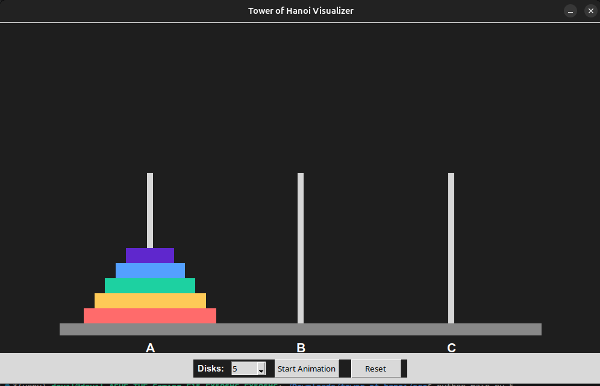

# Tower of Hanoi Visualizer

A graphical Tower of Hanoi visualizer built using Python and Tkinter that demonstrates recursion through animated disk movement.

---

# Features

- Recursive Tower of Hanoi algorithm
- Animated disk visualization
- Tkinter graphical interface
- Command-line disk input
- Interactive GUI controls
- Dynamic disk selection
- Reset and replay functionality
- Linux compatible
- Clean modular architecture

---

# Technologies Used

- Python 3
- Tkinter GUI Library

---

# Project Structure

```bash
tower-of-hanoi/
│
├── assets/
│   └── screenshot.png
│
├── output/
│   └── sample_output.txt
│
├── src/
│   ├── constants.py
│   ├── main.py
│   ├── tower_of_hanoi.py
│   └── ui.py
│
├── requirements.txt
├── README.md
└── .gitignore
```

---

# Screenshots



---

# How Recursion Works

The Tower of Hanoi algorithm works recursively:

1. Move `n-1` disks from source to auxiliary
2. Move the largest disk to destination
3. Move `n-1` disks from auxiliary to destination

Recursive relation:

T(n) = 2T(n-1) + 1

Minimum moves required:

2^n - 1

---

# Running the Project

Move into source directory:

```bash
cd src
```

Run with default disk count:

```bash
python main.py
```

Run with custom disk count:

```bash
python main.py 5
```

---

# Concepts Demonstrated

- Recursion
- Stack behavior
- GUI programming
- Animation systems
- Event-driven programming
- Modular software design

---

# License

This project was created for educational and mentorship purposes.
